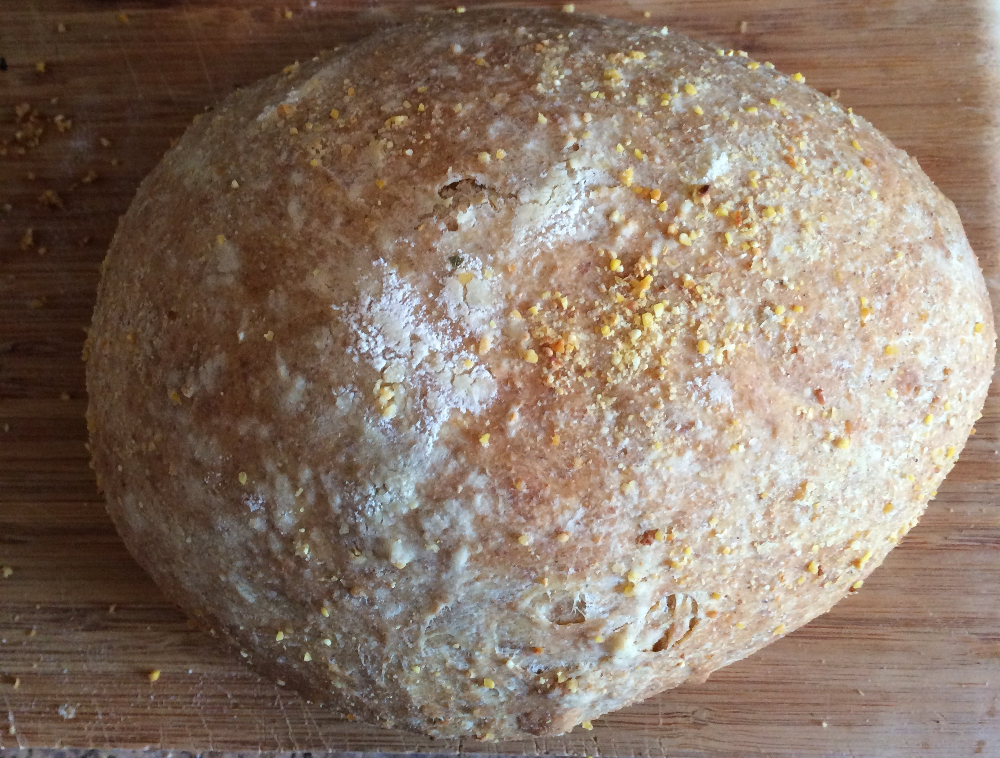
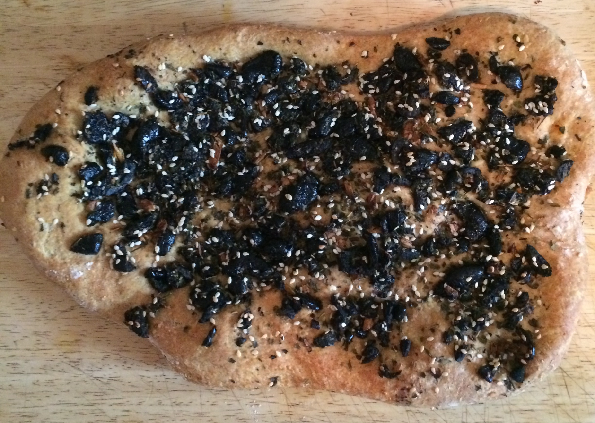

hi! how are you?

i _♥︎_ bread

i _make_ my own bread now





making bread helped me become a _better programmer_

... or, did it make me a better _architect_?

why?

1) embrace your _fears_!

i was _never good_ at baking

or so i thought

for me it was fear of getting things _wrong_

2) _patterns_ are useful.

there are _patterns for bread_

[Artisan Bread in Five](http://www.artisanbreadinfive.com/)

_1.5k_

plus like _50k_ more for Markdown conversion, CSS, and other stuff

 images too

* also
* lists
* as well

```javascript
var code = true;
```

based off [big by @tmcw](https://github.com/tmcw/big)

markdown by [marked](https://github.com/chjj/marked)

Syntax highlighting by [Highlight.js](http://softwaremaniacs.org/soft/highlight/en/)

JS+CSS [github.com/ calvinmetcalf/ medium](https://github.com/calvinmetcalf/medium)